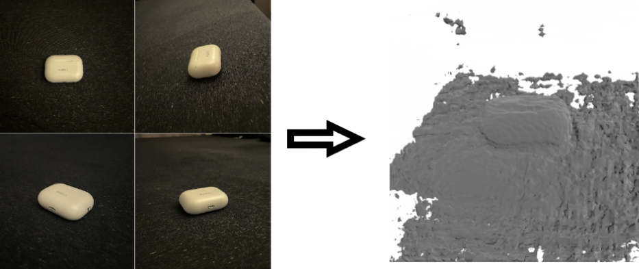
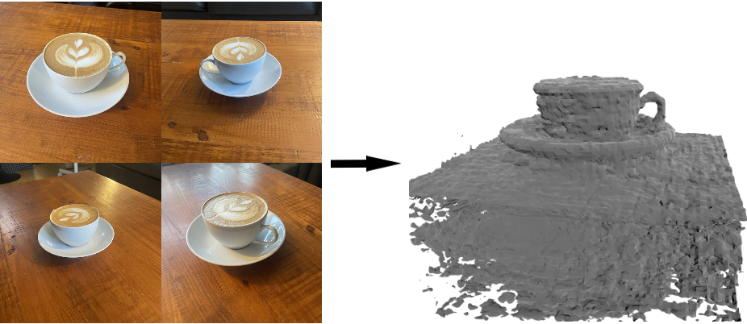

# NeRF Project
# Paper:
The full implementation process and discussion on results can be read [here](<A Beginner's Beginner Guide to NeRF.pdf>)
# Results:
Converting a dataset of 63 images of AirPods on a dark surface into a 3D meshgrid:

AirPods Density Meshgrid Gif:

Converting a dataset of 35 images of a Latte on a coffee table into a 3D meshgrid:

Latte Density Meshgrid Gif:

